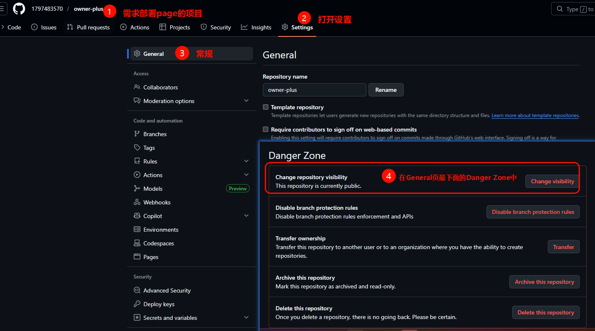

# GitHub Actions 部署 React 项目流程

本文档记录了使用 GitHub Actions 部署 React 项目的完整流程，包括配置步骤、常见问题及解决方案，可作为复用模板参考。

## 一、项目准备

### 1. 技术栈要求
- React 项目（本文以 Vite 构建工具为例）
- GitHub 仓库
- Node.js 环境
- GitHub项目权限：确保项目仓库设置为公开（Public），否则无法通过 GitHub Pages 部署。

### 2. 初始项目结构
```
project-root/
├── .github/
│   └── workflows/
│       └── deploy.yml  # GitHub Actions 配置文件
├── src/
│   └── ...  # React 源代码
├── package.json  # 项目依赖配置
├── vite.config.ts  # Vite 构建配置
└── ...
```

## 二、配置步骤

### 1. 配置 Vite 构建工具

**vite.config.ts**
```typescript
import path from 'path';
import { defineConfig, loadEnv } from 'vite';
import react from '@vitejs/plugin-react';

export default defineConfig(({ mode }) => {
    const env = loadEnv(mode, '.', '');
    return {
      base: './',  // 使用相对路径，兼容多种部署方式
      server: {
        port: 3000,
        host: '0.0.0.0',
      },
      plugins: [react()],
      // 其他配置...
    };
});
```

**关键配置说明**：
- `base: './'`：使用相对路径，确保资源在不同部署路径下都能正确加载

### 2. 配置 GitHub Actions 工作流

**创建 .github/workflows/deploy.yml 文件**
```yaml
name: Deploy to GitHub Pages

on:
  push:
    branches:
      - main  # 触发分支

permissions:
  contents: write  # 授予写入权限

jobs:
  build-and-deploy:
    concurrency: ci-${{ github.ref }}  # 并发控制
    runs-on: ubuntu-latest
    steps:
    - name: Checkout
      uses: actions/checkout@v4
        
    - name: Install and Build
      run: |
        npm install
        npm run build
      
    - name: Deploy
      uses: JamesIves/github-pages-deploy-action@v4
      with:
        folder: dist  # 构建输出目录
        branch: gh-pages  # 部署目标分支（不存在也可以，会自动创建）
```

**配置说明**：
- `permissions: contents: write`：确保 GitHub Actions 有写入仓库的权限
- `concurrency: ci-${{ github.ref }}`：防止多个部署任务同时执行
- `folder: dist`：Vite 默认构建输出目录
- `branch: gh-pages`：GitHub Pages 部署分支

### 3. 配置 package.json

确保 package.json 中包含正确的构建脚本：

```json
{
  "scripts": {
    "dev": "vite",
    "build": "vite build",  // 构建命令
    "preview": "vite preview"
  }
}
```

## 三、部署到 GitHub Pages

### 1. 首次部署流程
1. 推送代码到 main 分支
2. GitHub Actions 自动触发构建和部署
3. 部署完成后，在 GitHub 仓库设置中配置 Pages：
   - 进入 **Settings → Pages**
   - **Source** 选择 `Deploy from a branch`
   - **Branch** 选择 `gh-pages` 和 `/(root)`
   - 点击 **Save** 保存设置

### 2. 访问方式

部署完成后，可通过两种方式访问：
1. **默认 GitHub Pages 地址**：`https://username.github.io/repository/`，例如：https://1797483570.github.io/owner-plus/
2. **自定义域名**：需在 DNS 提供商处配置 CNAME 记录指向默认地址（优先在gitHub配置好域名）

## 四、常见问题及解决方案

### 1. 问题：部署失败，认证错误

**错误信息**：
```
fatal: Authentication failed for 'https://github.com/username/repository.git/'
```

**解决方案**：
- 在工作流文件中添加 `permissions: contents: write` 配置
- 确保使用的是最新版本的 GitHub Actions

### 2. 问题：部署后页面空白，资源加载失败

**错误信息**：
- 浏览器控制台显示 404 错误，资源路径不正确

**解决方案**：
- 修改 vite.config.ts 中的 base 配置为 `'./'`，使用相对路径
- 避免使用绝对路径引用资源

### 3. 问题：参数名错误

**错误信息**：
```
Warning: Unexpected input(s) 'ACCESS_TOKEN', valid inputs are ['ssh-key', 'token', ...]
```

**解决方案**：
- 使用正确的参数名，如 `token` 而不是 `ACCESS_TOKEN`
- 移除不必要的参数，使用默认值

### 4. 问题：部署目标分支错误

**错误信息**：
```
fatal: 'main' is already used by worktree at '/home/runner/work/repository/repository'
```

**解决方案**：
- 确保部署目标分支设置为 `gh-pages` 而不是 `main`
- 避免与主分支冲突

### 5. 问题：自定义域名访问空白

**原因**：
- 基础路径配置与部署路径不匹配

**解决方案**：
- 使用 `base: './'` 相对路径配置，兼容多种部署方式
- 避免硬编码绝对路径

## 五、优化建议

### 1. 性能优化
- 使用 `npm ci` 替代 `npm install`，加快依赖安装速度
- 添加缓存步骤，缓存 `node_modules` 目录

### 2. 安全性
- 避免在配置文件中硬编码敏感信息
- 使用 GitHub Secrets 管理环境变量

### 3. 可靠性
- 添加构建失败通知
- 配置部署状态检查

## 六、完整配置示例

### 1. vite.config.ts 完整配置

```typescript
import path from 'path';
import { defineConfig, loadEnv } from 'vite';
import react from '@vitejs/plugin-react';

export default defineConfig(({ mode }) => {
    const env = loadEnv(mode, '.', '');
    return {
      base: './',
      server: {
        port: 3000,
        host: '0.0.0.0',
      },
      plugins: [react()],
      define: {
        'process.env.API_KEY': JSON.stringify(env.API_KEY),
      },
      resolve: {
        alias: {
          '@': path.resolve(__dirname, '.'),
        }
      }
    };
});
```

### 2. deploy.yml 完整配置

```yaml
name: Deploy to GitHub Pages

on:
  push:
    branches:
      - main

permissions:
  contents: write

jobs:
  build-and-deploy:
    concurrency: ci-${{ github.ref }}
    runs-on: ubuntu-latest
    steps:
    - name: Checkout
      uses: actions/checkout@v4
        
    - name: Install and Build
      run: |
        npm install
        npm run build
      
    - name: Deploy
      uses: JamesIves/github-pages-deploy-action@v4
      with:
        folder: dist
        branch: gh-pages
```

## 七、总结

使用 GitHub Actions 部署 React 项目的核心要点：

1. **正确配置构建工具**：使用相对路径 `base: './'` 确保资源加载正确
2. **合理设置工作流**：添加必要的权限配置和并发控制
3. **选择合适的部署分支**：使用 `gh-pages` 分支作为部署目标
4. **处理不同访问方式**：通过相对路径配置兼容多种部署场景
5. **关注常见问题**：认证错误、资源加载失败等问题的排查和解决

通过本文档的配置示例和问题解决方案，您可以快速搭建起可靠的 GitHub Actions 部署流程，实现代码推送后自动构建和部署的完整 CI/CD 流程。

## 八、参考资源

- [GitHub Pages 官方文档](https://docs.github.com/cn/pages)
- [GitHub Actions 官方文档](https://docs.github.com/cn/actions)
- [JamesIves/github-pages-deploy-action](https://github.com/JamesIves/github-pages-deploy-action)
- [保姆级GitHub Actions部署React应用的快速入门](https://juejin.cn/post/7000370463188713480)
